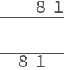
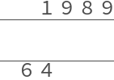
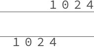
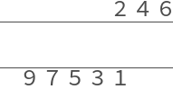
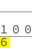
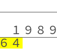
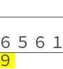
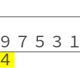

# Sun Tzŭ arithmetic animations

Mathematica code for [Sun Tzŭ arithmetic animations][animations],
which appear in my [translation of 《孫子算經》,
"Sun Tzŭ's Computational Classic"][sun-tzu];
see Vol.&nbsp;I ¶8 & ¶13 (multiplication) and ¶9 & ¶14 (division).

Licensed under "MIT No Attribution" (MIT-0), see [LICENSE](LICENSE).

##  Multiplication

### 81 × 81 = 6561

### 1989 × 64 = 127296

### 1024 × 1024 = 104857681

### 246 × 97531 = 23992626

## Division

### 100 ÷ 6 = 16 + 4/6

### 1989 ÷ 64 = 31 + 5/64

### 6561 ÷ 9 = 729

### 97531 ÷ 4 = 24382 + 3/4

[animations]: https://yawnoc.github.io/sun-tzu/code/animations
[sun-tzu]: https://yawnoc.github.io/sun-tzu/
